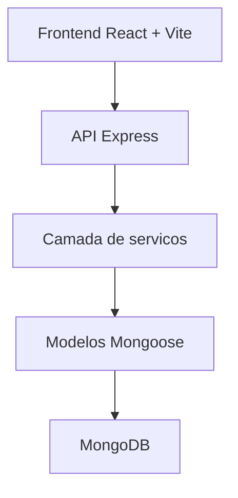
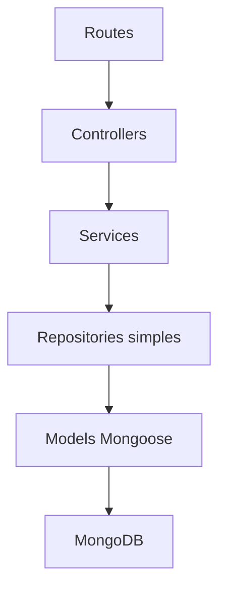
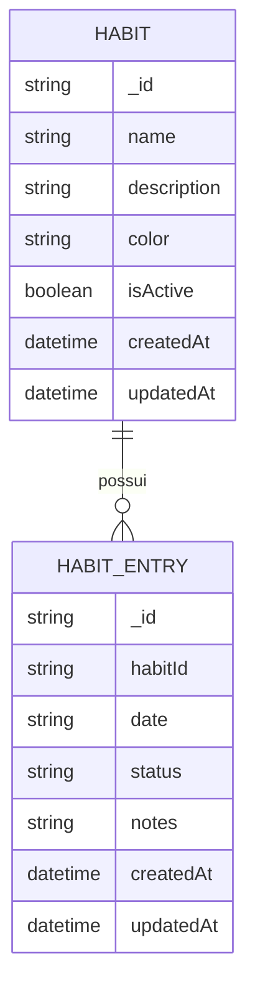

## 1. Desenho da Arquitetura


## 2. Descricao da Tecnologia
- Frontend: React 18 + Vite 6 + CSS customizado com arquitetura de componentes reutilizaveis
- Ferramenta de inicializacao: base existente com Vite no diretorio `client/`
- Backend: Express 4 no diretorio `server/`
- Banco de dados: MongoDB com Mongoose 8
- Tempo real: opcional para futuras sincronizacoes, sem dependencia inicial de sockets para o fluxo principal
- Estrategia de estado: React hooks locais e camada simples de servicos para requisicoes HTTP

## 3. Definicao de Rotas
| Rota | Objetivo |
|-------|---------|
| / | Painel principal com resumo do mes, habilidades e atalhos |
| /checklist | Checklist mensal por habilidade e por dia |
| /historico | Tela de historico com comparativo mensal e sequencias |
| /configuracoes | Ajustes simples de perfil e preferencias futuras |

## 4. Definicao de APIs

### 4.1 Tipos principais
```ts
type Habit = {
  _id: string;
  name: string;
  description?: string;
  color: string;
  isActive: boolean;
  createdAt: string;
  updatedAt: string;
};

type HabitEntryStatus = "done" | "missed" | "empty";

type HabitEntry = {
  _id: string;
  habitId: string;
  date: string; // formato YYYY-MM-DD
  status: HabitEntryStatus;
  notes?: string;
  createdAt: string;
  updatedAt: string;
};

type MonthlySummary = {
  month: string; // formato YYYY-MM
  totalHabits: number;
  totalDone: number;
  totalMissed: number;
  completionRate: number;
  currentStreak: number;
  bestStreak: number;
};
```

### 4.2 Endpoints
| Metodo | Endpoint | Objetivo |
|--------|----------|----------|
| GET | /api/habits | Listar habilidades ativas e arquivadas |
| POST | /api/habits | Criar nova habilidade |
| PUT | /api/habits/:id | Atualizar dados da habilidade |
| PATCH | /api/habits/:id/archive | Arquivar ou reativar habilidade |
| DELETE | /api/habits/:id | Remover habilidade |
| GET | /api/checklist?month=YYYY-MM | Buscar grade mensal completa |
| PUT | /api/checklist/:habitId/:date | Criar ou atualizar marcacao de um dia |
| GET | /api/summary?month=YYYY-MM | Buscar resumo consolidado do mes |
| GET | /api/history?from=YYYY-MM&to=YYYY-MM | Buscar historico comparativo entre meses |

### 4.3 Exemplo de contrato
```json
{
  "habit": {
    "_id": "6690fcb6d1f5346c2f2c1111",
    "name": "Praticar ingles",
    "description": "30 minutos de escuta e repeticao",
    "color": "#8EF6A3",
    "isActive": true,
    "createdAt": "2026-07-14T12:00:00.000Z",
    "updatedAt": "2026-07-14T12:00:00.000Z"
  }
}
```

## 5. Arquitetura do Servidor


## 6. Modelo de Dados
### 6.1 Definicao do Modelo


### 6.2 Definicao de Dados
```js
db.habits.createIndex({ name: 1 });
db.habitentries.createIndex({ habitId: 1, date: 1 }, { unique: true });
db.habitentries.createIndex({ date: 1 });

db.habits.insertOne({
  name: "Praticar violao",
  description: "20 minutos de tecnica e repertorio",
  color: "#8EF6A3",
  isActive: true,
  createdAt: new Date(),
  updatedAt: new Date()
});
```

## 7. Estrutura de Implementacao
- `client/src/components/`: componentes visuais do painel, formulario de habitos, grade mensal e cartoes de indicadores.
- `client/src/hooks/`: hooks para buscar resumo, habilidades e checklist mensal.
- `client/src/services/`: camada de acesso a API do habit tracker.
- `server/src/models/`: modelos `Habit` e `HabitEntry`.
- `server/src/routes/`: rotas de habitos, checklist, resumo e historico.
- `server/src/services/`: regras de calculo de sequencia, consolidacao mensal e composicao das respostas.
