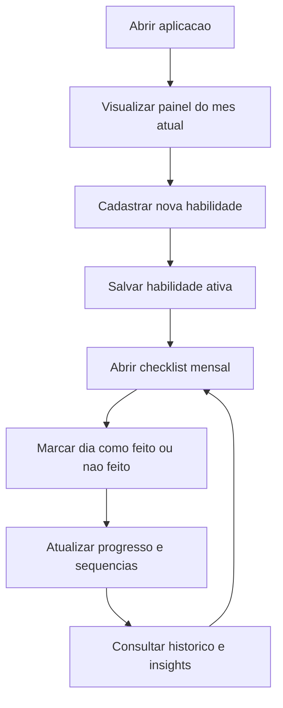

## 1. Visao Geral do Produto
Aplicacao web MERN para registrar habilidades que o usuario deseja praticar diariamente e acompanhar a execucao por meio de um checklist mensal.
- Resolve a falta de consistencia no treino diario, oferecendo visao clara dos dias cumpridos, pendentes e da evolucao de cada habilidade.
- Entrega valor como ferramenta pessoal de disciplina, acompanhamento de rotina e revisao mensal de desempenho.

## 2. Funcionalidades Centrais

### 2.1 Perfis de Usuario
| Papel | Metodo de cadastro | Permissoes centrais |
|------|---------------------|---------------------|
| Usuario padrao | Uso local inicialmente, com estrutura pronta para autenticacao futura | Criar, editar, arquivar e acompanhar habilidades e checklists mensais |

### 2.2 Modulos de Funcionalidade
1. **Painel principal**: resumo do mes, indicadores de consistencia, lista de habilidades ativas e acesso rapido ao calendario.
2. **Gestao de habilidades**: cadastro da habilidade, meta descritiva, cor de identificacao, observacoes e status ativo/inativo.
3. **Checklist mensal**: visualizacao em grade por dias do mes para marcar feito, nao feito ou nao planejado.
4. **Historico e insights**: taxa de conclusao por habilidade, sequencia atual, melhor sequencia e visao resumida por mes.

### 2.3 Detalhamento das Paginas
| Nome da pagina | Nome do modulo | Descricao da funcionalidade |
|-----------|-------------|---------------------|
| Painel principal | Cabecalho do periodo | Exibe mes selecionado, total de habilidades ativas, dias concluidos e percentual medio de execucao |
| Painel principal | Cartoes de indicadores | Mostra sequencia atual, melhor sequencia, total de marcacoes feitas e quantidade de falhas no mes |
| Painel principal | Lista de habilidades | Apresenta cada habilidade com nome, frequencia diaria, progresso mensal e atalhos de edicao |
| Painel principal | Resumo rapido | Destaca habilidades consistentes, habilidades em risco e dias recentes sem marcacao |
| Gestao de habilidades | Formulario de cadastro | Permite criar habilidade com nome, descricao curta, cor, objetivo e status |
| Gestao de habilidades | Lista gerenciavel | Permite editar, arquivar, reativar e remover habilidades |
| Checklist mensal | Grade mensal | Mostra colunas com os dias do mes e linhas por habilidade para marcar cumprimento |
| Checklist mensal | Marcacao por dia | Permite alternar rapidamente entre feito, nao feito e vazio |
| Checklist mensal | Navegacao de periodo | Permite trocar mes e ano sem perder contexto |
| Historico e insights | Graficos resumidos | Exibe tendencia de consistencia, percentual por habilidade e comparacao entre meses |
| Historico e insights | Bloco de sequencias | Exibe melhor sequencia, sequencia atual e ultima data concluida |

## 3. Fluxo Principal
O usuario acessa o painel, cadastra uma ou mais habilidades que deseja praticar diariamente e passa a registrar o cumprimento em uma grade mensal. Ao longo do mes, o sistema atualiza indicadores de progresso, destaca sequencias e permite revisar quais dias foram concluidos ou perdidos.

## 4. Design da Interface
### 4.1 Estilo Visual
- Cores principais: fundo escuro grafite, superfícies em azul petróleo profundo e acentos em verde-lima para conclusão, coral suave para falhas e âmbar para estados pendentes.
- Estilo de botões: cantos arredondados médios, contraste alto, feedback visual por brilho sutil e elevação curta no hover.
- Tipografia: fonte de destaque com personalidade geométrica para títulos e fonte limpa para textos e dados; hierarquia forte entre números, rótulos e conteúdo auxiliar.
- Layout: desktop-first com painel lateral leve, área principal em cartões e grade mensal ampla para leitura rápida.
- Iconografia: ícones lineares simples, consistentes e discretos, reforçando status sem poluir a tela.

### 4.2 Visao por Pagina
| Nome da pagina | Nome do modulo | Elementos de UI |
|-----------|-------------|-------------|
| Painel principal | Cartoes de indicadores | Numeros grandes, mini barras de progresso, cores por status e animação curta de entrada |
| Painel principal | Lista de habilidades | Cartoes compactos com cor da habilidade, progresso e ações rápidas |
| Checklist mensal | Grade mensal | Cabeçalho fixo dos dias, células clicáveis, legenda de cores e destaque do dia atual |
| Checklist mensal | Navegacao de periodo | Seletor de mes com botões laterais e atalho para voltar ao mes atual |
| Historico e insights | Graficos | Barras e linhas simples, contraste alto e tooltips discretos |

### 4.3 Responsividade
- Estrategia desktop-first, com adaptacao para tablet e mobile.
- No mobile, a grade mensal deve permitir scroll horizontal controlado sem comprometer a leitura dos nomes das habilidades.
- Interacoes devem ser otimizadas para clique e toque, com alvos confortaveis e estados visuais claros.
